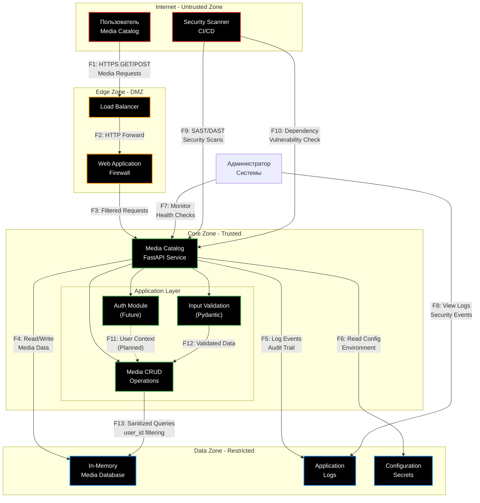
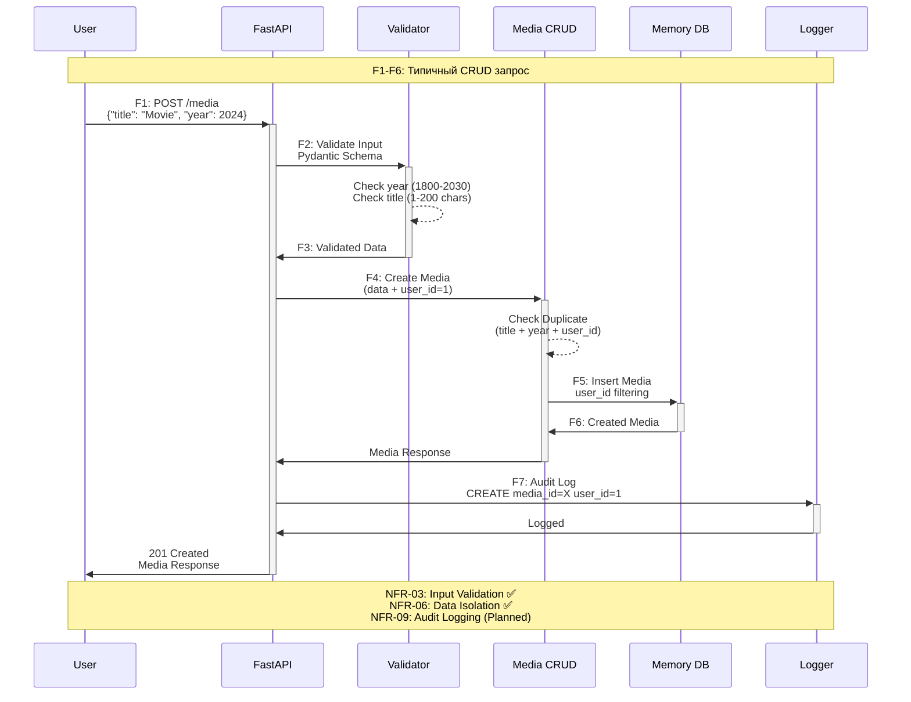

# Data Flow Diagram (DFD)

## Media Catalog API - Архитектура и потоки данных

### Контекстная диаграмма

### Детальная диаграмма - Media CRUD Flow

### Потоки данных (F1-F13)

| ID | Поток | Протокол | Данные | Угрозы (STRIDE) | Перевод |
|----|-------|----------|--------|-----------------|----------------------|
| **F1** | User → Load Balancer | HTTPS | HTTP Requests (JSON) | Man-in-the-middle, Request tampering | Перехват данных, подмена запросов |
| **F2** | LB → WAF | HTTP | Forwarded requests | Protocol downgrade | Понижение протокола безопасности |
| **F3** | WAF → FastAPI | HTTP | Filtered requests | Injection attacks | Инъекционные атаки |
| **F4** | API → Memory DB | In-process | Media objects | Data corruption | Повреждение данных |
| **F5** | API → Logs | File I/O | Log entries | Log injection | Инъекция в логи |
| **F6** | API → Config | Environment | Secrets, settings | Information disclosure | Раскрытие конфиденциальной информации |
| **F7** | Admin → API | HTTPS | Health checks | Privilege escalation | Повышение привилегий |
| **F8** | Admin → Logs | File access | Log viewing | Unauthorized access | Несанкционированный доступ |
| **F9** | Scanner → API | HTTPS | Security tests | False positives | Ложные срабатывания сканера |
| **F10** | Scanner → Dependencies | Package scan | Vulnerability data | Supply chain | Атаки на цепочку поставок |
| **F11** | Auth → Media | In-process | User context | Session hijacking | Захват сессии |
| **F12** | Validator → Media | In-process | Validated data | Validation bypass | Обход валидации |
| **F13** | Media → Memory DB | In-process | Filtered queries | Data isolation breach | Нарушение изоляции данных |

### Архитектурные решения безопасности

#### Текущие контроли

- **Input Validation** (NFR-03): Pydantic схемы на всех входах
- **Data Isolation** (NFR-06): user_id фильтрация в CRUD
- **Pre-commit Security** (NFR-04): Базовые хуки безопасности

#### Планируемые контроли

- **Rate Limiting** (NFR-08): Защита от DoS по F1
- **Request Size Limits** (NFR-07): Защита от больших payload по F3
- **Error Response Security** (NFR-13): Безопасные ошибки по F1-F3
- **Audit Logging** (NFR-09): Логирование по F4-F5
- **Content-Type Validation** (NFR-11): Строгая проверка по F1-F3

#### Будущие улучшения

- **Authentication & Authorization**: Замена заглушки CURRENT_USER_ID=1
- **HTTPS Enforcement**: TLS termination в Edge зоне
- **Database Security**: Переход с in-memory на реальную БД с шифрованием
